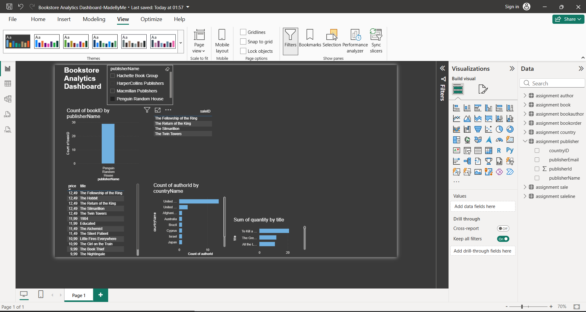

# 📚 Bookstore Analytics Dashboard

## 🛠️ Tools Used
- MySQL — database and queries
- Power BI — dashboard and visualization

## 📊 What This Project Covers
- Books per publisher analysis
- Top 5 most expensive books
- Most sold books by quantity
- Books that have never been sold
- Authors per country breakdown
- Interactive publisher slicer

## 🖼️ Dashboard Preview

## 👤 Author
BIT Student | Aspiring Data Analyst
